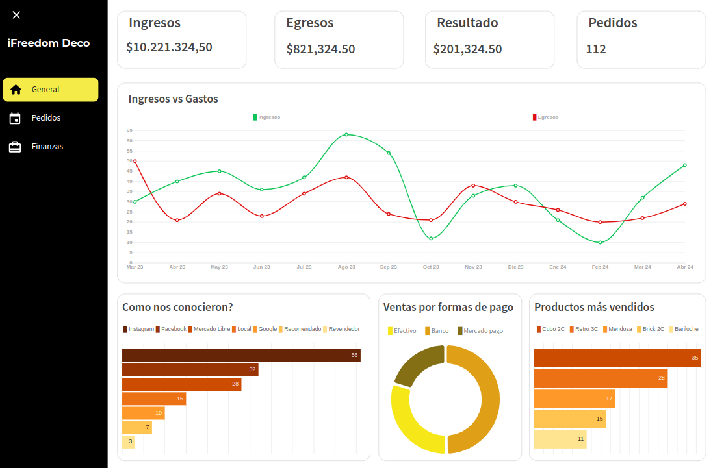
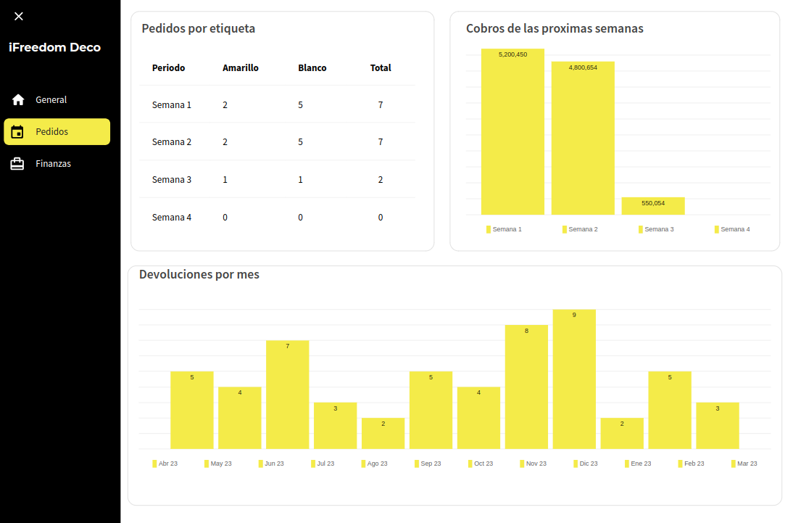
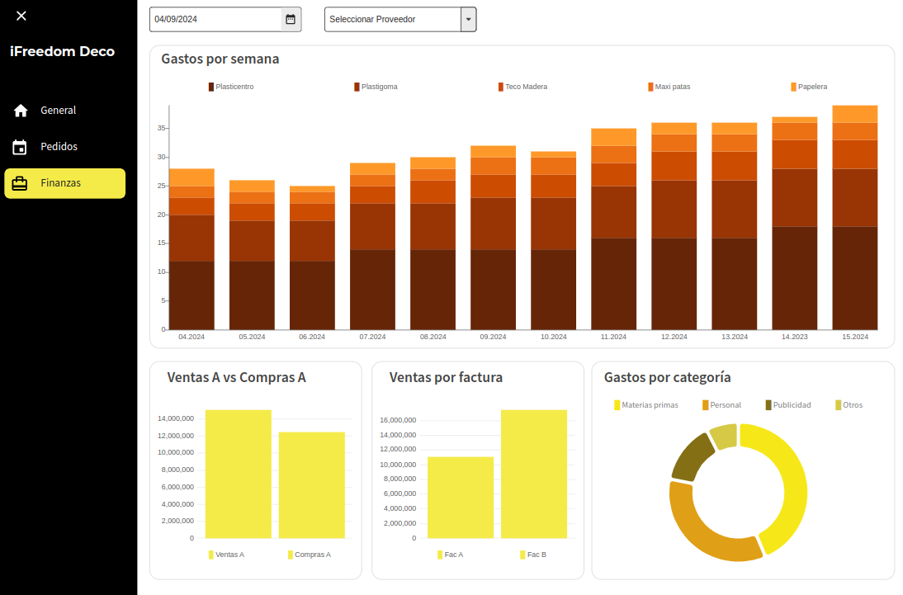

# Gestión de pedidos - Fabrica de sillones

Este proyecto consiste en automatizar la carga, procesamiento y visualización de datos de una fabrica de sillones. 
La aplicación se desarrolló utilizando Google Apps Script y Google Sheets.

## Descripción

El calendario de pedidos permite a los usuarios:

- **Actualizar automáticamente:** Los datos del calendario se actualizan automáticamente cada vez que se carga un pedido en el formulario y se modifican los datos de la hoja de cálculo de pedidos.
- **Visualizar pedidos:** Los pedidos se muestran en el calendario con colores diferentes según su estado o etiqueta.
- **Gestionar pedidos:** Los usuarios pueden agregar pedidos desde el formulario de google, y editar y eliminar pedidos directamente desde la hoja de cálculo de pedidos.

## Dashboard

Mockup del tablero de visualización aprobado por el cliente:

### Contenido del Repositorio
- `dashboard`: Archivo de Power BI y capturas del mockup del dashboard.
- `archivos.gs`: Archivos con funciones que se activan cuando se ingresan datos en el formulario.

---
**Ezequiel Mettler**
| Data Analyst | [LinkedIn](https://www.linkedin.com/in/ezequiel-mettler/) | [Portfolio Web](https://sites.google.com/view/ezemettler) | Contacto: [ehmettler@gmail.com](mailto:ehmettler@gmail.com)
